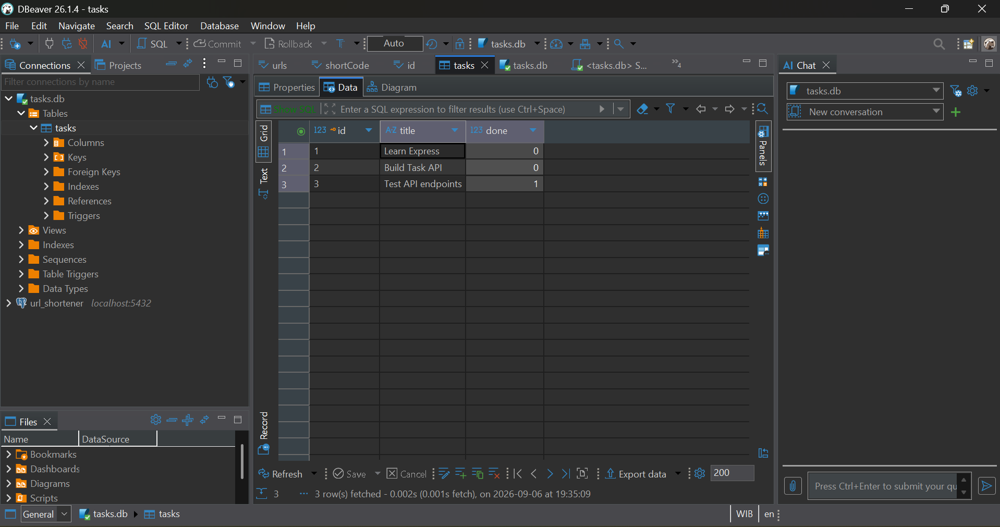

# Task API

A REST API for managing tasks, built with Node.js, Express.js, PostgreSQL, Docker, Docker Compose, Swagger/OpenAPI, and Supabase Auth.

This project was developed as part of my internship at **FlyRank AI** across **Week 2, Week 3, and Week 4**.

The project evolved incrementally:

- **Week 2:** Built the CRUD API using an in-memory array.
- **Week 3:** Migrated the storage layer to PostgreSQL and containerized the application and database using Docker Compose.
- **Week 4:** Added Supabase Authentication with signup, login, protected routes, logout, and authentication verification.

The project focuses on practical backend development concepts including REST API design, CRUD operations, request validation, HTTP status codes, SQL, PostgreSQL, Docker, Docker Compose, Swagger/OpenAPI, authentication, JWT access tokens, and Git/GitHub Pull Request workflow.

---

# Tech Stack

- Node.js 22
- Express.js
- PostgreSQL
- `pg`
- `dotenv`
- `@supabase/supabase-js`
- Docker
- Docker Compose
- Swagger UI
- OpenAPI
- DBeaver
- Git & GitHub
- Supabase Auth

---

# Features

## Task API

- Create a new task
- Get all tasks
- Get a task by ID
- Update a task
- Delete a task
- Request validation
- HTTP status code handling
- Persistent task storage with PostgreSQL
- Automatic database connection
- Automatic table creation
- Initial seed data only when the table is empty
- Parameterized SQL queries
- Dockerized application
- Dockerized PostgreSQL database
- PostgreSQL persistence using a named Docker volume
- Interactive API documentation with Swagger UI

## Authentication

- User signup with Supabase Auth
- User login with Supabase Auth
- JWT access token authentication
- Protected API route
- Bearer token validation
- Authenticated logout
- Unauthorized request handling
- Authentication verification through Supabase Auth Users

---

# Getting Started

## Requirements

Make sure you have installed:

- Docker Desktop
- Git

Docker Desktop provides both Docker Engine and Docker Compose.

Check your installation:

```bash
docker --version
docker compose version
git --version
```

Node.js and npm are only required if you want to run or develop the application directly outside Docker.

---

# Quick Start

The application and PostgreSQL database are designed to run together using Docker Compose.

## 1. Clone the repository

```bash
git clone https://github.com/alfinmuzakkiiman/FlyRankIntern-task-api.git
```

Navigate to the project:

```bash
cd FlyRankIntern-task-api
```

---

## 2. Create the environment file

Copy the example environment file.

### Windows PowerShell

```powershell
Copy-Item .env.example .env
```

### Linux / macOS

```bash
cp .env.example .env
```

The `.env.example` file contains:

```env
DATABASE_URL=postgres://postgres:dev@db:5432/tasks
SUPABASE_URL=https://your-project.supabase.co
SUPABASE_KEY=your_supabase_public_key
PORT=3000
```

Update the Supabase values in `.env` with the values from your Supabase project.

The actual `.env` file is ignored by Git and must not be committed.

---

# Supabase Setup

Week 4 uses Supabase Auth for user authentication.

## 1. Create a Supabase project

Create a project from the Supabase dashboard.

During project creation:

- Choose a project name.
- Choose the desired region.
- Save the database password securely.

---

## 2. Get the Supabase project credentials

The application requires:

```env
SUPABASE_URL=https://your-project.supabase.co
SUPABASE_KEY=your_supabase_public_key
```

`SUPABASE_KEY` should contain the Supabase **publishable/public key**.

Do **not** use the Supabase secret key for this application.

Do not commit Supabase credentials to Git.

---

## 3. Email confirmation for development

For local development, email confirmation can be disabled in the Supabase Authentication settings so that newly registered users can log in immediately.

This is intended for development/testing purposes.

---

# Environment Variables

The application uses the following environment variables:

| Variable | Description | Example |
|----------|-------------|---------|
| `DATABASE_URL` | PostgreSQL connection string | `postgres://postgres:dev@db:5432/tasks` |
| `SUPABASE_URL` | Supabase project URL | `https://your-project.supabase.co` |
| `SUPABASE_KEY` | Supabase publishable/public key | `your_supabase_public_key` |
| `PORT` | API port | `3000` |

The project includes `.env.example` as a template.

The actual `.env` file is ignored by Git:

```gitignore
.env
```

### Security note

Do not commit real credentials or secrets to the repository.

Do not use or expose the Supabase secret key / `service_role` key in the application or repository.

---

# Start the Application

Start the complete stack:

```bash
docker compose up
```

Or run in detached mode:

```bash
docker compose up -d
```

Docker Compose starts:

- Task API
- PostgreSQL database

The API will be available at:

```text
http://localhost:3000
```

PostgreSQL is exposed to the host on:

```text
localhost:5433
```

Inside the Docker Compose network, the application connects to PostgreSQL using:

```text
db:5432
```

---

# Verify the API

## Health Check

```bash
curl -i http://localhost:3000/health
```

Expected response:

```http
HTTP/1.1 200 OK
```

```json
{
  "status": "ok"
}
```

---

# Swagger API Documentation

Interactive API documentation is available through Swagger UI:

```text
http://localhost:3000/docs
```

Swagger UI allows the API endpoints to be explored and tested directly from the browser using the **Try it out** feature.

The OpenAPI specification is stored in:

```text
openapi.json
```

---

# API Endpoints

## General

| Method | Endpoint | Description |
|--------|----------|-------------|
| GET | `/` | Get API information |
| GET | `/health` | Check API health |
| GET | `/docs` | Swagger UI documentation |

---

## Task Endpoints

| Method | Endpoint | Description |
|--------|----------|-------------|
| GET | `/tasks` | Get all tasks |
| GET | `/tasks/:id` | Get a task by ID |
| POST | `/tasks` | Create a new task |
| PUT | `/tasks/:id` | Update a task |
| DELETE | `/tasks/:id` | Delete a task |

---

## Authentication Endpoints

| Method | Endpoint | Authentication | Description |
|--------|----------|----------------|-------------|
| POST | `/auth/signup` | No | Register a new user |
| POST | `/auth/login` | No | Login and receive an access token |
| GET | `/protected/profile` | Bearer token | Get authenticated user information |
| POST | `/auth/logout` | Bearer token | Logout the authenticated user |

---

# Authentication Flow

The authentication flow uses Supabase Auth.

```text
Client
  |
  | POST /auth/signup
  v
Supabase Auth
  |
  | User created
  v
Client
  |
  | POST /auth/login
  v
Supabase Auth
  |
  | accessToken
  v
Client
  |
  | Authorization: Bearer <accessToken>
  v
Express API
  |
  | requireAuth middleware
  v
Supabase Auth
  |
  | Valid user
  v
Protected Route
```

---

# Signup

Create a new user account using:

```http
POST /auth/signup
```

Request body:

```json
{
  "email": "test.signup@example.com",
  "password": "Password123!"
}
```

Example response:

```http
HTTP/1.1 201 Created
```

```json
{
  "userId": "user-uuid",
  "email": "test.signup@example.com"
}
```

The user is created through Supabase Auth.

---

## Signup Validation

Email and password are required.

Example invalid request:

```json
{
  "email": "",
  "password": ""
}
```

Expected response:

```http
HTTP/1.1 400 Bad Request
```

```json
{
  "error": "Email and password are required"
}
```

If the email has already been registered:

```http
HTTP/1.1 409 Conflict
```

```json
{
  "error": "Email already registered"
}
```

---

# Login

Login using:

```http
POST /auth/login
```

Request body:

```json
{
  "email": "test.signup@example.com",
  "password": "Password123!"
}
```

Expected response:

```http
HTTP/1.1 200 OK
```

The response contains an access token:

```json
{
  "accessToken": "eyJ...",
  "user": {
    "id": "user-uuid",
    "email": "test.signup@example.com"
  }
}
```

The `accessToken` is used to access protected endpoints.

---

## Login Validation

If the email or password is missing:

```http
HTTP/1.1 400 Bad Request
```

If the credentials are invalid:

```http
HTTP/1.1 401 Unauthorized
```

```json
{
  "error": "Invalid email or password"
}
```

---

# Protected Route

The protected endpoint is:

```http
GET /protected/profile
```

It requires a valid Bearer access token.

Add the following HTTP header:

```http
Authorization: Bearer <accessToken>
```

Example:

```bash
curl -i http://localhost:3000/protected/profile \
  -H "Authorization: Bearer <accessToken>"
```

Expected response:

```http
HTTP/1.1 200 OK
```

```json
{
  "userId": "user-uuid",
  "email": "test.signup@example.com"
}
```

---

## Protected Route Without Token

Request:

```bash
curl -i http://localhost:3000/protected/profile
```

Expected response:

```http
HTTP/1.1 401 Unauthorized
```

```json
{
  "error": "Unauthorized"
}
```

The route is protected by the authentication middleware.

---

## Invalid Token

If an invalid or expired token is provided:

```http
Authorization: Bearer invalid-token
```

The API returns:

```http
HTTP/1.1 401 Unauthorized
```

```json
{
  "error": "Unauthorized"
}
```

---

# Authentication Middleware

The protected route uses an authentication middleware:

```text
Client
  |
  | Authorization: Bearer <token>
  v
requireAuth
  |
  | Supabase auth.getUser(token)
  v
Valid user?
  |
  +---- No ----> 401 Unauthorized
  |
  +---- Yes ---> req.user
                    |
                    v
              Protected Route
```

The authenticated Supabase user is attached to:

```javascript
req.user
```

The protected profile endpoint uses this authenticated user information to return:

```json
{
  "userId": "user-uuid",
  "email": "user@example.com"
}
```

---

# Logout

Logout uses:

```http
POST /auth/logout
```

The endpoint requires a valid Bearer access token.

Example:

```bash
curl -i -X POST http://localhost:3000/auth/logout \
  -H "Authorization: Bearer <accessToken>"
```

Expected response:

```http
HTTP/1.1 200 OK
```

```json
{
  "message": "Logout successful"
}
```

The logout endpoint creates an authenticated Supabase client using the user's access token and calls Supabase Auth logout.

---

## Logout Without Authentication

If the logout endpoint is called without a valid Bearer token:

```http
HTTP/1.1 401 Unauthorized
```

```json
{
  "error": "Unauthorized"
}
```

---

# Authentication Testing Flow

The complete authentication flow can be tested in this order:

```text
1. POST /auth/signup
        |
        v
2. POST /auth/login
        |
        | receive accessToken
        v
3. GET /protected/profile
        |
        | valid token
        v
      200 OK
        |
        v
4. GET /protected/profile
        |
        | no token
        v
      401 Unauthorized
        |
        v
5. POST /auth/logout
        |
        | valid token
        v
      200 OK
```

---

# Important Note About Access Tokens

Supabase access tokens are JWTs with a limited lifetime.

Calling the logout endpoint ends the authenticated Supabase session, but an already-issued access token may continue to be accepted until it expires.

Therefore, the expected logout verification is:

```text
POST /auth/logout
        ↓
200 Logout successful
```

The API does not implement a custom JWT blacklist.

---

# Task Object

A task has the following structure:

```json
{
  "id": 1,
  "title": "Learn Express",
  "done": false
}
```

| Field | Type | Description |
|-------|------|-------------|
| `id` | number | Unique task ID |
| `title` | string | Task title |
| `done` | boolean | Task completion status |

---

# Task API Examples

## Get All Tasks

```bash
curl -i http://localhost:3000/tasks
```

Example response:

```http
HTTP/1.1 200 OK
```

```json
[
  {
    "id": 1,
    "title": "Learn Express",
    "done": false
  },
  {
    "id": 2,
    "title": "Build Task API",
    "done": false
  },
  {
    "id": 3,
    "title": "Test API endpoints",
    "done": true
  }
]
```

The data is read directly from PostgreSQL.

---

# Create a Task

```bash
curl -i -X POST http://localhost:3000/tasks \
  -H "Content-Type: application/json" \
  -d '{"title":"Buy milk"}'
```

Expected response:

```http
HTTP/1.1 201 Created
```

```json
{
  "id": 4,
  "title": "Buy milk",
  "done": false
}
```

The server automatically:

- Generates the task ID through PostgreSQL
- Trims the title
- Sets `done` to `false`
- Inserts the task into PostgreSQL

---

# Update a Task

```bash
curl -i -X PUT http://localhost:3000/tasks/1 \
  -H "Content-Type: application/json" \
  -d '{"title":"Learn Express Updated","done":true}'
```

Expected response:

```http
HTTP/1.1 200 OK
```

```json
{
  "id": 1,
  "title": "Learn Express Updated",
  "done": true
}
```

---

# Delete a Task

```bash
curl -i -X DELETE http://localhost:3000/tasks/1
```

Expected response:

```http
HTTP/1.1 204 No Content
```

The response body is empty because the task was successfully deleted.

---

# Validation

The API validates incoming request data.

## Create Task Validation

The `title` field is required and must be a non-empty string.

Invalid request:

```json
{}
```

Expected response:

```http
HTTP/1.1 400 Bad Request
```

```json
{
  "error": "Title is required"
}
```

Whitespace-only titles are also rejected.

---

## Update Task Validation

An update must contain at least one of:

- `title`
- `done`

The `title` must be a non-empty string.

The `done` field must be a boolean.

Example invalid body:

```json
{
  "done": "true"
}
```

Expected response:

```http
HTTP/1.1 400 Bad Request
```

```json
{
  "error": "Done must be a boolean"
}
```

---

# HTTP Status Codes

| Status Code | Meaning |
|-------------|---------|
| `200` | Request successful |
| `201` | Resource created successfully |
| `204` | Resource deleted successfully |
| `400` | Invalid request or validation error |
| `401` | Unauthorized / invalid authentication |
| `404` | Resource not found |
| `409` | Conflict, such as an already registered email |
| `500` | Internal server error |

---

# Database

The PostgreSQL database is automatically initialized when the application starts.

The `tasks` table is created if it does not already exist.

Schema:

```sql
CREATE TABLE IF NOT EXISTS tasks (
  id SERIAL PRIMARY KEY,
  title TEXT NOT NULL,
  done BOOLEAN NOT NULL DEFAULT FALSE
);
```

If the table is empty, the application inserts three example tasks:

```text
Learn Express
Build Task API
Test API endpoints
```

Seed data is inserted only when the table contains zero rows.

---

# Database Schema

The `tasks` table contains:

| Column | PostgreSQL Type | Description |
|--------|------------------|-------------|
| `id` | `SERIAL` / integer | Primary key and unique task ID |
| `title` | `TEXT` | Task title |
| `done` | `BOOLEAN` | Task completion status |

---

# Database Viewer

The PostgreSQL database can be inspected using `psql` or DBeaver.

Open `psql` inside the running PostgreSQL container:

```bash
docker exec -it taskdb psql -U postgres -d tasks
```

List tables:

```sql
\dt
```

Describe the tasks table:

```sql
\d tasks
```

View all tasks:

```sql
SELECT * FROM tasks ORDER BY id;
```

---

# PostgreSQL Persistence

PostgreSQL data is stored using a named Docker volume:

```text
taskdata
```

The volume is mounted at:

```text
/var/lib/postgresql/data
```

Architecture:

```text
Task API Container
       |
       v
PostgreSQL Container
       |
       v
Named Docker Volume
       |
       v
Persistent Database Data
```

Because the database uses a named volume, recreating the containers does not remove the stored PostgreSQL data.

To stop the stack:

```bash
docker compose down
```

Start it again:

```bash
docker compose up -d
```

Existing tasks remain available.

> Do not use `docker compose down -v` when testing persistence because the `-v` option removes the Compose-managed volumes.

---

# Docker Architecture

The Docker Compose stack contains two services:

```text
services:
  app
  db
```

## App

The Task API runs on:

```text
localhost:3000
```

## Database

PostgreSQL runs on:

```text
localhost:5433
```

Inside the Docker Compose network, the API connects to:

```text
db:5432
```

---

# One-Command Stack

The main goal of the Dockerization stage is that a new developer does not need to manually install or configure PostgreSQL.

The expected flow is:

```text
Clone repository
      |
      v
Copy .env.example to .env
      |
      v
docker compose up
      |
      v
Task API + PostgreSQL start
      |
      v
Database table is created automatically
      |
      v
Seed data is inserted if the table is empty
      |
      v
GET /tasks
```

---

# Project Structure

```text
FlyRankIntern-task-api/
├── docs/
│   ├── database-viewer.png
│   └── swagger-ui.png
├── repositories/
│   ├── postgres.js
│   └── supabase.js
├── .dockerignore
├── .env.example
├── .gitignore
├── docker-compose.yml
├── Dockerfile
├── openapi.json
├── package.json
├── package-lock.json
├── README.md
└── server.js
```

---

# Main Files

| File | Purpose |
|------|---------|
| `server.js` | Express server, routes, authentication middleware, validation, and application startup |
| `repositories/postgres.js` | PostgreSQL connection, initialization, seed logic, and database operations |
| `repositories/supabase.js` | Supabase client configuration |
| `openapi.json` | OpenAPI specification used by Swagger UI |
| `package.json` | Project metadata, scripts, and dependencies |
| `package-lock.json` | Locked dependency versions |
| `Dockerfile` | Defines the Task API container image |
| `docker-compose.yml` | Runs the Task API and PostgreSQL together |
| `.dockerignore` | Files excluded from the Docker build context |
| `.env.example` | Example environment configuration |
| `.gitignore` | Files excluded from Git |
| `README.md` | Project documentation |

---

# Dockerfile

The application uses Node.js 22 Alpine:

```dockerfile
FROM node:22-alpine

WORKDIR /app

COPY package*.json ./

RUN npm ci

COPY . .

EXPOSE 3000

CMD ["npm", "start"]
```

The Docker image installs dependencies using:

```bash
npm ci
```

and starts the Express application using:

```bash
npm start
```

---

# Git Workflow

The project was developed incrementally using Git branches and Pull Requests.

## Week 2

```text
Stage 0 → Hello Server
Stage 1 → Root & Health
Stage 2 → Read Tasks
Stage 3 → Create Task
Stage 4 → Update & Delete
Stage 5 → Swagger UI
Stage 6 → Publish & Documentation
Stage 7 → AI Rematch
```

## Week 3

```text
Stage 0 → PostgreSQL Docker setup
Stage 1 → PostgreSQL connection
Stage 2 → PostgreSQL read endpoints
Stage 3 → PostgreSQL CRUD
Stage 4 → Dockerize app + database
Stage 5 → Publish & Documentation
```

## Week 4

```text
Stage 0 → Initialize Supabase + local setup
Stage 1 → Signup
Stage 2 → Login
Stage 3 → Auth Middleware + Protected Route
Stage 4 → Logout
Stage 5 → Proof / Verification
Stage 6 → Documentation
```

Each stage was developed on a separate branch, tested locally, committed, pushed to GitHub, reviewed through a Pull Request, and merged into `main`.

The development workflow was:

```text
Create branch
     |
     v
Implement one stage
     |
     v
Test locally
     |
     v
Self-review
     |
     v
Commit
     |
     v
Push
     |
     v
Pull Request
     |
     v
Review
     |
     v
Merge into main
```

---

# Week 2 → Week 3 → Week 4 Progress

The project evolved from a simple in-memory CRUD API into a database-backed, containerized API with authentication.

## Week 2

```text
Client
  |
  v
Express API
  |
  v
JavaScript Array
```

The focus was:

- REST API fundamentals
- CRUD
- Validation
- HTTP status codes
- Swagger/OpenAPI
- Git/GitHub workflow

---

## Week 3

```text
Client
  |
  v
Express API
  |
  v
PostgreSQL Repository
  |
  v
PostgreSQL
  |
  v
Docker Volume
```

The focus was:

- Database setup
- PostgreSQL schema
- SQL queries
- Persistent storage
- CRUD operations with SQL
- Repository-based database access
- Docker
- Docker Compose
- Database persistence
- One-command application startup
- Database exploration
- Documentation

The API contract stayed the same while the storage implementation changed.

---

## Week 4

```text
Client
  |
  v
Express API
  |
  +----------------------+
  |                      |
  v                      v
Task API             Supabase Auth
  |                      |
  v                      v
PostgreSQL           Authentication
```

The focus was:

- Supabase project setup
- Supabase Auth
- User signup
- User login
- JWT access tokens
- Bearer authentication
- Authentication middleware
- Protected routes
- Logout
- Authentication verification
- API security basics
- Documentation

---

# Parameterized SQL Queries

The PostgreSQL repository uses parameterized queries for values supplied by requests.

For example:

```sql
SELECT * FROM tasks WHERE id = $1
```

The ID is passed separately as a query parameter.

Other CRUD operations also use PostgreSQL parameters such as `$1`, `$2`, and `$3`.

This keeps request values separate from the SQL statement instead of constructing SQL through string concatenation.

---

# Verification Checklist

The following checklist can be used to verify the Week 4 authentication implementation.

## API

- [x] `GET /health` returns `200 OK`
- [x] Swagger UI is available at `/docs`
- [x] Task CRUD endpoints are available
- [x] PostgreSQL is running through Docker Compose

## Signup

- [x] `POST /auth/signup` returns `201 Created` for valid input
- [x] Empty email/password returns `400 Bad Request`
- [x] Duplicate email returns `409 Conflict`

## Login

- [x] `POST /auth/login` returns `200 OK` for valid credentials
- [x] Login response contains an access token
- [x] Invalid credentials return `401 Unauthorized`
- [x] Empty email/password returns `400 Bad Request`

## Protected Route

- [x] `/protected/profile` is protected by authentication middleware
- [x] Valid Bearer token returns `200 OK`
- [x] Missing token returns `401 Unauthorized`
- [x] Invalid token returns `401 Unauthorized`

## Logout

- [x] `POST /auth/logout` requires authentication
- [x] Authenticated logout returns `200 OK`
- [x] Logout without authentication returns `401 Unauthorized`

## Supabase

- [x] Supabase Auth is configured
- [x] Registered users can be viewed in Supabase Auth Users
- [x] Supabase public/publishable key is used
- [x] Supabase secret/service-role key is not used in the application
- [x] `.env` is ignored by Git

---

# Proof / Verification Screenshots

The final project documentation should include screenshots showing the completed implementation.

Recommended screenshots:

## 1. Health Check

Show:

```text
GET /health
```

Expected:

```json
{
  "status": "ok"
}
```

---

## 2. Swagger UI

Show:

```text
http://localhost:3000/docs
```

The screenshot should demonstrate that the API documentation is available and the endpoints can be tested through Swagger UI.

---

## 3. Signup Response

Show:

```text
POST /auth/signup
```

with a successful:

```text
201 Created
```

response.

Do not expose sensitive credentials in the screenshot.

---

## 4. Login Response

Show:

```text
POST /auth/login
```

with a successful:

```text
200 OK
```

response containing an access token.

> Do not publish or commit a real access token in the repository or public documentation.

---

## 5. Protected Route — 200

Show:

```text
GET /protected/profile
```

with:

```text
Authorization: Bearer <accessToken>
```

Expected:

```text
200 OK
```

---

## 6. Protected Route — 401

Show:

```text
GET /protected/profile
```

without a Bearer token.

Expected:

```text
401 Unauthorized
```

---

## 7. Logout

Show:

```text
POST /auth/logout
```

with a valid Bearer token.

Expected:

```text
200 OK
```

```json
{
  "message": "Logout successful"
}
```

---

## 8. Supabase Auth Users

Show the Supabase dashboard's authentication users list containing the test account created during development.

Do not expose unnecessary personal information or secrets.

---

# Database Screenshot

PostgreSQL can be inspected using DBeaver or `psql`.

Example screenshot location:

```text
docs/database-viewer.png
```



---

# Swagger Screenshot

Example screenshot location:

```text
docs/swagger-ui.png
```


---

# Clean Clone Checkpoint

The project is intended to be runnable by a new developer without manual PostgreSQL database setup.

Complete flow:

```bash
git clone https://github.com/alfinmuzakkiiman/FlyRankIntern-task-api.git
cd FlyRankIntern-task-api
```

Create the environment file.

### Windows PowerShell

```powershell
Copy-Item .env.example .env
```

### Linux / macOS

```bash
cp .env.example .env
```

Configure the Supabase values in `.env`.

Start the stack:

```bash
docker compose up
```

Then verify:

```bash
curl http://localhost:3000/health
```

Expected:

```json
{
  "status": "ok"
}
```

Swagger UI:

```text
http://localhost:3000/docs
```

---

# Stopping the Application

To stop the stack:

```bash
docker compose down
```

This removes the containers and network but keeps the named PostgreSQL volume.

To start the stack again:

```bash
docker compose up -d
```

Existing database data remains available.

> Do not use `docker compose down -v` if you want to preserve the PostgreSQL data. The `-v` option removes the Compose-managed volumes.

---

# Learning Outcomes

Through Week 2, Week 3, and Week 4, I practiced:

- Building REST APIs with Node.js and Express.js
- Understanding HTTP methods
- Implementing CRUD operations
- Handling JSON request bodies
- Validating client input
- Using appropriate HTTP status codes
- Handling unknown resources with `404 Not Found`
- Using `204 No Content` for successful deletion
- Testing APIs with `curl`
- Testing APIs through Swagger UI
- Writing OpenAPI specifications
- Moving from in-memory storage to persistent database storage
- Connecting Node.js to PostgreSQL
- Writing SQL queries
- Using parameterized SQL queries
- Understanding PostgreSQL schema design
- Understanding database initialization and seed data
- Understanding Docker containers
- Using Docker Compose
- Using named Docker volumes
- Verifying database persistence after container recreation
- Exploring PostgreSQL using `psql` and DBeaver
- Setting up Supabase Auth
- Implementing user signup
- Implementing user login
- Working with JWT access tokens
- Implementing Bearer token authentication
- Creating authentication middleware
- Protecting API routes
- Implementing logout
- Testing authentication success and failure cases
- Understanding basic authentication security practices
- Writing project documentation
- Using Git branches and commits
- Creating and reviewing Pull Requests
- Merging feature branches into `main`
- Publishing a backend project to GitHub

---

# Internship Context

This project was developed as part of my internship at **FlyRank AI**.

The project was built incrementally so that each stage introduced one main backend concept.

The development process was:

```text
Build
  |
  v
Test
  |
  v
Validate
  |
  v
Document
  |
  v
Review
  |
  v
Commit
  |
  v
Pull Request
  |
  v
Merge
```

The goal was not only to make the API work, but also to practice a development workflow that can be repeated on larger backend projects.

---

# Final Project Architecture

```text
                    Client
                      |
          +-----------+-----------+
          |                       |
          v                       v
     Task Endpoints          Auth Endpoints
          |                       |
          v                       v
     Express API            Supabase Auth
          |                       |
          v                       v
 PostgreSQL Repository      Access Token / User
          |
          v
     PostgreSQL
          |
          v
     Docker Volume
```

The application consists of three main layers:

1. **Express API**
   - Handles HTTP requests and responses.
   - Provides task and authentication endpoints.
   - Performs request validation.
   - Protects authenticated routes.

2. **PostgreSQL**
   - Stores task data persistently.
   - Runs inside Docker Compose.
   - Uses a named volume for persistence.

3. **Supabase Auth**
   - Handles user authentication.
   - Provides signup and login.
   - Issues access tokens.
   - Validates authenticated users.

---

# Final Notes

Week 2 established the API fundamentals.

Week 3 changed the storage layer from an in-memory array to PostgreSQL and introduced Docker-based development.

Week 4 added Supabase Authentication and protected API functionality.

The final result is a CRUD API that:

- Uses Node.js and Express.js
- Stores task data in PostgreSQL
- Runs with Docker Compose
- Provides Swagger/OpenAPI documentation
- Supports Supabase user authentication
- Provides signup and login
- Protects API routes using Bearer access tokens
- Supports authenticated logout
- Includes validation and appropriate HTTP status codes

The application and database can be started together with:

```bash
docker compose up
```

The API is available at:

```text
http://localhost:3000
```

Swagger documentation is available at:

```text
http://localhost:3000/docs
```

The database is exposed at:

```text
localhost:5433
```

This project provides a foundation for future backend work where the API layer, database layer, authentication layer, and deployment environment can continue to evolve independently.