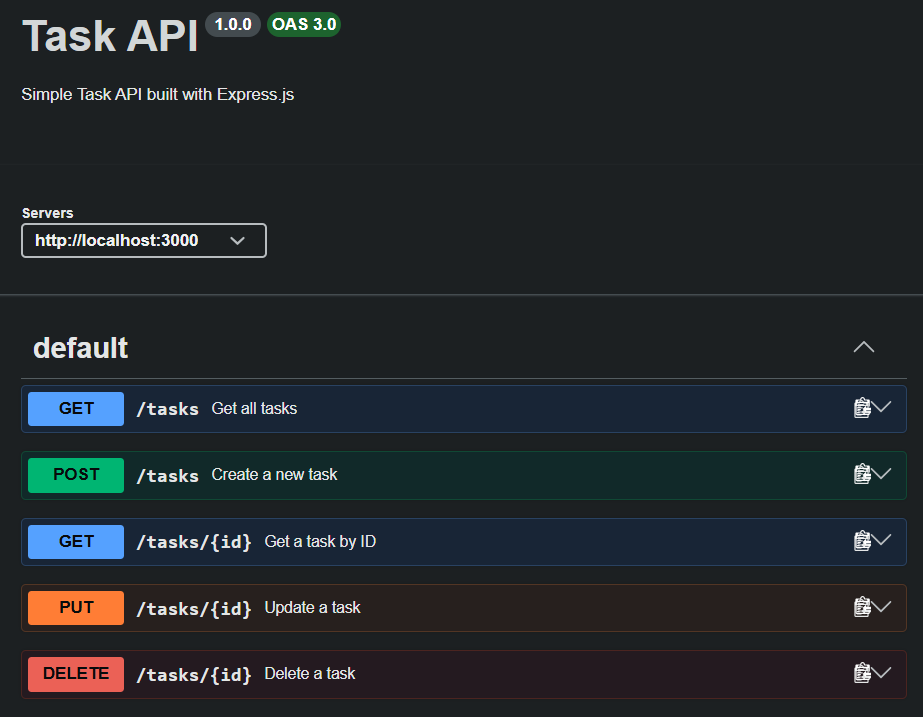

# Task API

A simple REST API for managing tasks, built with Node.js and Express.js.

This project was developed as part of my internship at **FlyRank AI** during **Week 2**. The project focuses on learning and implementing fundamental backend development concepts, including REST API design, CRUD operations, request validation, HTTP status codes, Git/GitHub workflow, and API documentation using Swagger UI.

## Tech Stack

* Node.js
* Express.js
* Swagger UI
* OpenAPI
* Git & GitHub

## Features

* Create a new task
* Get all tasks
* Get a task by ID
* Update a task
* Delete a task
* Request validation
* HTTP status code handling
* Interactive API documentation with Swagger UI

---

## Getting Started

### Requirements

Make sure you have installed:

* Node.js
* npm
* Git

Check your installation:

```bash
node --version
npm --version
git --version
```

### Installation

Clone the repository:

```bash
git clone https://github.com/alfinmuzakkiiman/FlyRankIntern-task-api.git
```

Navigate to the project directory:

```bash
cd FlyRankIntern-task-api
```

Install the project dependencies:

```bash
npm install
```

### Run the Server

Start the API:

```bash
npm start
```

The server will run at:

```text
http://localhost:3000
```

You should see:

```text
Task API running on http://localhost:3000
```

### Verify the API

Check the health endpoint:

```bash
curl -i http://localhost:3000/health
```

Example response:

```text
HTTP/1.1 200 OK
Content-Type: application/json; charset=utf-8
```

```json
{
  "status": "ok"
}
```

---

## API Documentation

Interactive API documentation is available through Swagger UI:

```text
http://localhost:3000/docs
```

Swagger UI allows you to explore and test the API directly from your browser using the **Try it out** feature.

### Swagger UI Preview



---

## API Endpoints

| Method | Endpoint     | Description         |
| ------ | ------------ | ------------------- |
| GET    | `/`          | Get API information |
| GET    | `/health`    | Check API health    |
| GET    | `/tasks`     | Get all tasks       |
| GET    | `/tasks/:id` | Get a task by ID    |
| POST   | `/tasks`     | Create a new task   |
| PUT    | `/tasks/:id` | Update a task       |
| DELETE | `/tasks/:id` | Delete a task       |

---

## Task Object

A task has the following structure:

```json
{
  "id": 1,
  "title": "Learn Express",
  "done": false
}
```

| Field   | Type    | Description            |
| ------- | ------- | ---------------------- |
| `id`    | number  | Unique task ID         |
| `title` | string  | Task title             |
| `done`  | boolean | Task completion status |

---

## CRUD Flow

The API supports the complete CRUD lifecycle:

```text
POST /tasks
    ↓
Create a task
    ↓
GET /tasks
    ↓
Get all tasks
    ↓
GET /tasks/:id
    ↓
Get one task
    ↓
PUT /tasks/:id
    ↓
Update the task
    ↓
DELETE /tasks/:id
    ↓
Delete the task
```

After deleting a task, requesting the same ID returns:

```text
404 Not Found
```

---

## Example API Requests

### Get All Tasks

```bash
curl -i http://localhost:3000/tasks
```

Example response:

```text
HTTP/1.1 200 OK
X-Powered-By: Express
Content-Type: application/json; charset=utf-8
```

```json
[
  {
    "id": 1,
    "title": "Learn Express",
    "done": false
  },
  {
    "id": 2,
    "title": "Build Task API",
    "done": false
  },
  {
    "id": 3,
    "title": "Test API endpoints",
    "done": true
  }
]
```

### Get a Task by ID

```bash
curl -i http://localhost:3000/tasks/1
```

Example response:

```json
{
  "id": 1,
  "title": "Learn Express",
  "done": false
}
```

### Create a Task

```bash
curl -i -X POST http://localhost:3000/tasks \
  -H "Content-Type: application/json" \
  -d '{"title":"Buy milk"}'
```

Example response:

```text
HTTP/1.1 201 Created
Content-Type: application/json; charset=utf-8
```

```json
{
  "id": 4,
  "title": "Buy milk",
  "done": false
}
```

The server automatically:

* Generates the next task ID
* Sets `done` to `false`
* Adds the task to the in-memory list

### Update a Task

```bash
curl -i -X PUT http://localhost:3000/tasks/1 \
  -H "Content-Type: application/json" \
  -d '{"title":"Learn Express Updated","done":true}'
```

Example response:

```text
HTTP/1.1 200 OK
```

```json
{
  "id": 1,
  "title": "Learn Express Updated",
  "done": true
}
```

### Delete a Task

```bash
curl -i -X DELETE http://localhost:3000/tasks/1
```

Example response:

```text
HTTP/1.1 204 No Content
```

The response body is empty because the task was successfully deleted.

---

## Validation

The API validates incoming request data.

### Create Task Validation

The `title` field is required and cannot be empty.

Request:

```bash
curl -i -X POST http://localhost:3000/tasks \
  -H "Content-Type: application/json" \
  -d '{}'
```

Response:

```text
HTTP/1.1 400 Bad Request
```

```json
{
  "error": "Title is required"
}
```

### Update Task Validation

An update must contain at least one of:

* `title`
* `done`

The `title` must be a non-empty string.

The `done` field must be a boolean.

Example invalid body:

```json
{
  "done": "true"
}
```

Response:

```text
HTTP/1.1 400 Bad Request
```

```json
{
  "error": "Done must be a boolean"
}
```

### Unknown Task

If a task ID does not exist, the API returns `404 Not Found`.

Example:

```bash
curl -i http://localhost:3000/tasks/99
```

Response:

```text
HTTP/1.1 404 Not Found
```

```json
{
  "error": "Task 99 not found"
}
```

---

## HTTP Status Codes

| Status Code | Meaning                             |
| ----------- | ----------------------------------- |
| `200`       | Request successful                  |
| `201`       | Resource created successfully       |
| `204`       | Resource deleted successfully       |
| `400`       | Invalid request or validation error |
| `404`       | Resource not found                  |

---

## Data Storage

This project uses an **in-memory array** to store tasks.

There is currently no database or persistent storage.

Because the data is stored only in memory:

* Newly created tasks are lost when the server restarts.
* Updated tasks return to their initial state after a restart.
* Deleted tasks return to the initial example dataset after a restart.

The application starts with three example tasks.

---

## Project Structure

```text
FlyRankIntern-task-api/
├── docs/
│   └── swagger-ui.png
├── openapi.json
├── package.json
├── package-lock.json
├── README.md
├── server.js
└── .gitignore
```

### Main Files

| File                  | Purpose                                                      |
| --------------------- | ------------------------------------------------------------ |
| `server.js`           | Express server, routes, validation, and in-memory task logic |
| `openapi.json`        | OpenAPI specification used by Swagger UI                     |
| `package.json`        | Project metadata, scripts, and dependencies                  |
| `README.md`           | Project documentation                                        |
| `docs/swagger-ui.png` | Swagger UI screenshot                                        |
| `.gitignore`          | Files ignored by Git                                         |

---

## Git Workflow

The project was developed incrementally using Git branches and Pull Requests.

```text
Stage 0 → Hello Server
Stage 1 → Root & Health
Stage 2 → Read Tasks
Stage 3 → Create Task
Stage 4 → Update & Delete
Stage 5 → Swagger UI
Stage 6 → Publish & Documentation
```

Each stage was developed on a separate branch, tested locally, committed, pushed to GitHub, reviewed through a Pull Request, and merged into `main`.

---

## Learning Outcomes

Through this project, I practiced:

* Building REST APIs with Node.js and Express.js
* Understanding HTTP methods
* Implementing CRUD operations
* Handling JSON request bodies
* Validating client input
* Using appropriate HTTP status codes
* Handling unknown resources with `404 Not Found`
* Using `204 No Content` for successful deletion
* Testing APIs with `curl`
* Testing APIs through Swagger UI
* Writing OpenAPI specifications
* Using Git branches and commits
* Creating and reviewing Pull Requests
* Merging feature branches into `main`
* Publishing a backend project to GitHub

---

## Internship Context

This project was developed as part of my **Week 2 internship at FlyRank AI**.

The project was built incrementally from a basic Express server into a complete CRUD API with validation, Swagger/OpenAPI documentation, and a GitHub-based development workflow.

The main goal was not only to build a working API, but also to understand the backend development flow step by step:

```text
Build
  ↓
Test
  ↓
Validate
  ↓
Document
  ↓
Review
  ↓
Commit
  ↓
Pull Request
  ↓
Merge
```
